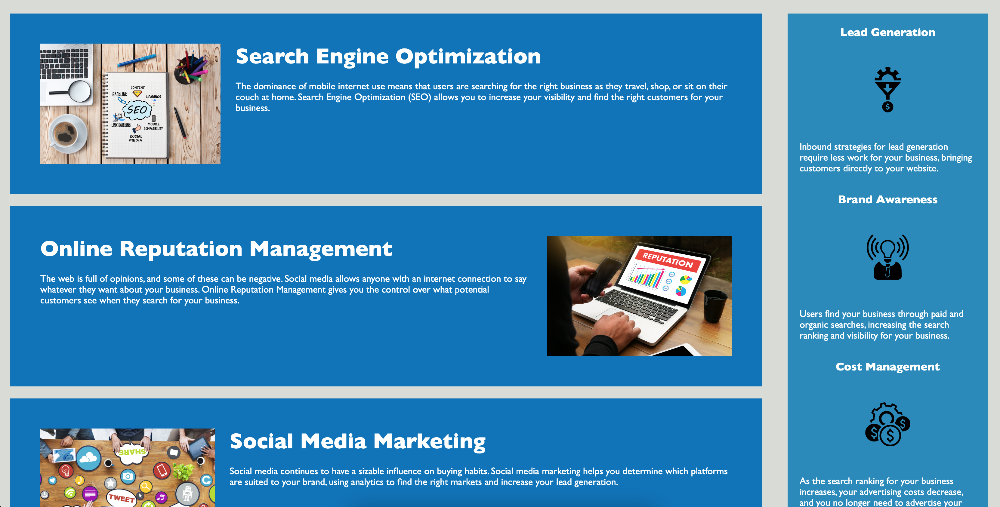

# Code Refactor for Horiseon Webpage

## Description

The webpage code has been re-factored to meet accessibility criteria for people with disabilities to access the page services.

To achieve these accessibility standards, the following changes were implemented

1. A descriptive title was given to the page.
2. HTML elements were migrated to semantic HTML elements.
3. All images were given an alt text to facilitate ease of accessibility.
4. The headings were changed to follow a sequential order.
5. Class attributes were changed to minimize the loading time and remove redundancies where possible.
6. Broken links were fixed.

## Links to the page

[Page Link](https://oksanatak.github.io/codefactor/)
[GITHUB](https://github.com/OksanaTak/codefactor) 

## Mock-Up

The following image shows the web application's appearance and functionality:

